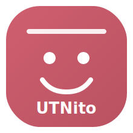

<h1>
  
  Programming III - UTN | UTNito Course Project
</h1>

## English

### Project Overview
This repository contains the practical course material and implementation workspace for Programming III (University Technical Degree in Programming - UTN BA). The course is based on building a real software system step by step, from setup and frontend foundations to backend, persistence, integration, and deployment.

### Architecture (High Level)
- Frontend: Angular (`chat-app`)
- Backend: NestJS + TypeScript (`chat-core-service`)
- Data layer: SQLite/PostgreSQL depending on sprint stage
- Automation/AI layer: n8n workflows + provider integration
- Container stack: `chat-docker`

### Technologies
- TypeScript
- Angular
- NestJS
- TypeORM
- SQLite / PostgreSQL
- Docker / Docker Compose
- n8n

### Methodology
The course follows an incremental, project-based approach focused on building a real system instead of isolated exercises.

The repository is split into two complementary workspaces:
- [`utn-utnito/full_project`](./utn-utnito/full_project): complete reference implementation
- [`utn-utnito/course`](./utn-utnito/course): class-by-class checkpoints

Each class combines short concept explanation with immediate guided coding:
- Introduce one concept
- Apply it in code during the same class
- Validate expected behavior
- Continue from that same codebase in the next class

This creates cumulative progress every week.  
By the end of the term, students understand the theory and also deliver a functional, portfolio-ready system with a production-style structure.

### UTNito General Architecture

Conceptual high-level diagram.  
For technical and up-to-date architecture details, see [`utn-utnito/full_project/README.md`](./utn-utnito/full_project).

Port note:
- Docker stack references: `4300` (frontend), `4012` (backend), `5690` (n8n), `5454` (PostgreSQL).
- Local development references: `5300` (frontend), `5001` (backend).

## Español

### Descripción del proyecto
Este repositorio contiene el material práctico de cursada y el espacio de implementación de Programación III (Tecnicatura Universitaria en Programación - UTN BA). La materia está basada en construir un sistema real paso a paso, desde setup y fundamentos de frontend hasta backend, persistencia, integración y despliegue.

### Arquitectura (alto nivel)
- Frontend: Angular (`chat-app`)
- Backend: NestJS + TypeScript (`chat-core-service`)
- Capa de datos: SQLite/PostgreSQL según la etapa de sprint
- Capa de automatización/AI: workflows de n8n + integración de provider
- Stack de contenedores: `chat-docker`

### Tecnologías
- TypeScript
- Angular
- NestJS
- TypeORM
- SQLite / PostgreSQL
- Docker / Docker Compose
- n8n

### Metodología
La materia utiliza un enfoque incremental orientado a proyecto real, en lugar de ejercicios aislados.

El repositorio se divide en dos espacios complementarios:
- [`utn-utnito/full_project`](./utn-utnito/full_project): implementación completa de referencia
- [`utn-utnito/course`](./utn-utnito/course): checkpoints por clase

Cada clase combina explicación breve y aplicación práctica inmediata:
- Se presenta un concepto
- Se implementa en código durante la misma clase
- Se valida el comportamiento esperado
- Se continúa sobre esa misma base en la clase siguiente

Esto genera avance acumulativo en cada encuentro.  
Al finalizar la cursada, el estudiante no solo comprende la teoría, sino que además entrega un sistema funcional, útil para portfolio y estructurado con criterios similares a un entorno profesional.

### Arquitectura General de UTNito

Diagrama conceptual de alto nivel.  
Para el detalle técnico actualizado, ver [`utn-utnito/full_project/README.md`](./utn-utnito/full_project).

Nota de puertos:
- Referencias del stack Docker: `4300` (frontend), `4012` (backend), `5690` (n8n), `5454` (PostgreSQL).
- Referencias de desarrollo local: `5300` (frontend), `5001` (backend).
