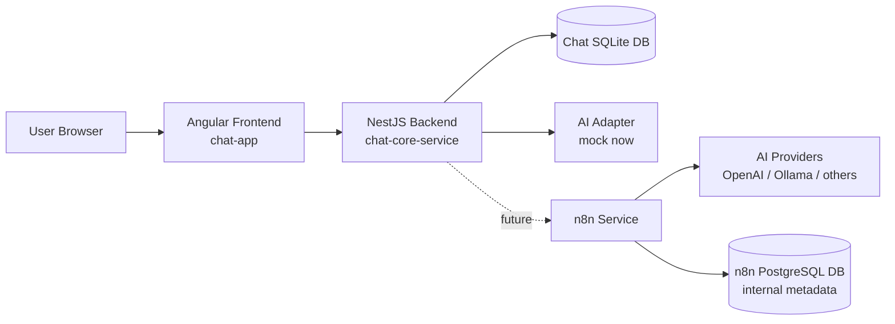
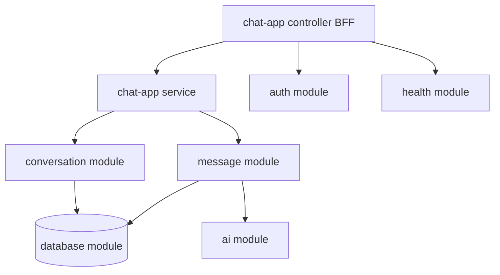
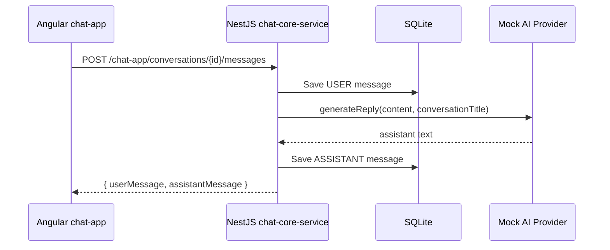
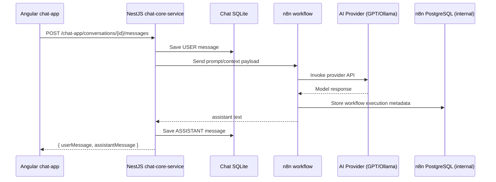

<h1>
  
  utn-utnito full project
</h1>

## English

### Prerequisites

Install these dependencies in your machine:

- Node.js LTS (includes `npm`)
- Docker Desktop (Docker Engine + Docker Compose)
- Git

### Recommended Tools

- Visual Studio Code
- Docker Desktop
- DBeaver

### Project Introduction

`utn-utnito` is a course project that teaches students how to build a real chat-based system incrementally.  
The monorepo contains both the complete reference implementation (`full_project`) and class-by-class educational checkpoints (`course`).

### Monorepo Layout

```txt
full_project/
  backend/
    chat-core-service/   # NestJS + TypeScript
    n8n/
      workflows/
  frontend/
    chat-app/            # Angular
    chat-html/           # Static UI prototypes
  chat-docker/
    docker-compose.yml
    .env.example
  scripts/
    setup.sh
    setup.ps1
    doctor.sh
    doctor.ps1
    start.sh
    start.ps1
  docs/
```

### Frontend Architecture

- Technology: Angular + TypeScript.
- App: `frontend/chat-app`.
- Main responsibilities:
  - Login screen and chat shell UI.
  - Conversation list, message stream, message composer.
  - Route protection with auth guard.
  - JWT propagation via HTTP interceptor.
  - Locale-based UI strings (Spanish/English).
- API integration:
  - Uses `coreServiceUrl` from environment.
  - Consumes backend BFF endpoints under `/chat-app/*`.

### Backend Architecture

- Technology: NestJS + TypeScript + TypeORM.
- Service: `backend/chat-core-service`.
- Main modules:
  - `health` for service status.
  - `auth` for login/refresh/me with JWT.
  - `chat-app` as BFF aligned to frontend use cases.
  - `conversation` for conversation lifecycle.
  - `message` for message persistence and response orchestration.
  - `ai` for provider abstraction (`mock` currently active).
  - `database` for SQLite configuration in current sprint.
- AI integration strategy:
  - Current sprint: backend `ai` module uses local `mock` provider.
  - Target flow: backend calls n8n workflow, n8n orchestrates external AI providers (OpenAI, Ollama, etc.), then returns response to backend.
- Persistence model:
  - `conversations` table with `ACTIVE | INACTIVE | ARCHIVED`.
  - `messages` table with `USER | ASSISTANT`.
  - `n8n` uses PostgreSQL only for its own internal runtime data (not for chat business data).

### Architecture Diagrams

#### 1) Container View



#### 2) Backend Module View



#### 3) Message Flow (Current Sprint)



#### 4) Message Flow (Target with n8n)



### Quick Start

1. Create local environment file:

```bash
cp chat-docker/.env.example chat-docker/.env
```

2. Run setup:

```bash
./scripts/setup.sh
```

3. Start local stack:

```bash
./scripts/start.sh
```

For Windows PowerShell, use `.ps1` variants.

### Default URLs

- Frontend: `http://localhost:4300`
- Core service health: `http://localhost:4012/health`
- Core service Swagger: `http://localhost:4012/api`
- n8n: `http://localhost:5690`

---

## Español

### Prerrequisitos

Instalar estas dependencias en la máquina:

- Node.js LTS (incluye `npm`)
- Docker Desktop (Docker Engine + Docker Compose)
- Git

### Herramientas Recomendadas

- Visual Studio Code
- Docker Desktop
- DBeaver

### Introducción del Proyecto

`utn-utnito` es un proyecto de cursada para enseñar cómo construir un sistema real de chat de forma incremental.  
El monorepo incluye tanto la implementación de referencia completa (`full_project`) como los checkpoints por clase (`course`).

### Estructura del Monorepo

```txt
full_project/
  backend/
    chat-core-service/   # NestJS + TypeScript
    n8n/
      workflows/
  frontend/
    chat-app/            # Angular
    chat-html/           # Prototipos estáticos de UI
  chat-docker/
    docker-compose.yml
    .env.example
  scripts/
    setup.sh
    setup.ps1
    doctor.sh
    doctor.ps1
    start.sh
    start.ps1
  docs/
```

### Arquitectura Frontend

- Tecnología: Angular + TypeScript.
- Aplicación: `frontend/chat-app`.
- Responsabilidades principales:
  - Pantalla de login y shell de chat.
  - Lista de conversaciones, stream de mensajes y composer.
  - Protección de rutas con auth guard.
  - Propagación de JWT con interceptor HTTP.
  - Textos de UI por locale (español/inglés).
- Integración API:
  - Usa `coreServiceUrl` desde environment.
  - Consume endpoints BFF del backend bajo `/chat-app/*`.

### Arquitectura Backend

- Tecnología: NestJS + TypeScript + TypeORM.
- Servicio: `backend/chat-core-service`.
- Módulos principales:
  - `health` para estado del servicio.
  - `auth` para login/refresh/me con JWT.
  - `chat-app` como BFF alineado a casos de uso del frontend.
  - `conversation` para ciclo de vida de conversaciones.
  - `message` para persistencia de mensajes y orquestación de respuesta.
  - `ai` para abstracción de proveedor (`mock` activo actualmente).
  - `database` para configuración SQLite en este sprint.
- Estrategia de integración con IA:
  - Sprint actual: el módulo `ai` del backend usa proveedor `mock` local.
  - Flujo objetivo: el backend invoca un workflow de n8n, n8n orquesta proveedores externos de IA (OpenAI, Ollama, etc.) y devuelve la respuesta al backend.
- Modelo de persistencia:
  - Tabla `conversations` con `ACTIVE | INACTIVE | ARCHIVED`.
  - Tabla `messages` con `USER | ASSISTANT`.
  - `n8n` usa PostgreSQL únicamente para sus datos internos de ejecución (no para los datos de negocio del chat).

### Diagramas de Arquitectura

Los diagramas de contenedores, módulos y flujo de mensajes son los mismos definidos en la sección en inglés de este documento.

### Inicio Rápido

1. Crear archivo de entorno local:

```bash
cp chat-docker/.env.example chat-docker/.env
```

2. Ejecutar setup:

```bash
./scripts/setup.sh
```

3. Levantar stack local:

```bash
./scripts/start.sh
```

En Windows PowerShell, usar variantes `.ps1`.

### URLs por Defecto

- Frontend: `http://localhost:4300`
- Health del core service: `http://localhost:4012/health`
- Swagger del core service: `http://localhost:4012/api`
- n8n: `http://localhost:5690`
